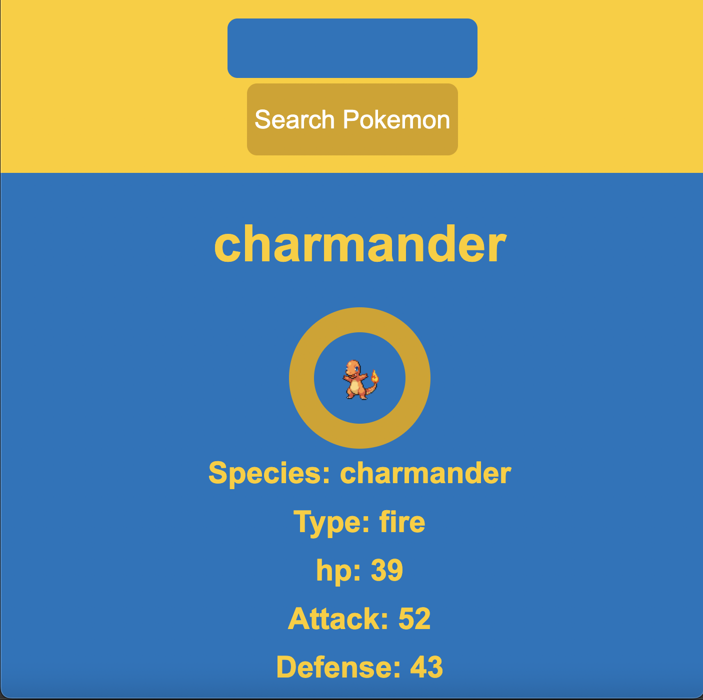

# Pokedex web app

**[Test this app yourself]()**

---

#### Navigation

- About Project
  - _Description_
  - _Developed With_
- How to use this Project
  - _Description_
  - _Developed With_
- Contact
  - _Mail_ 
  - _GitHub_
  - _LinkedIn_
- Used Tools
  - _Fonts_
  - _Design_
  - _Icons_
  - _Colors_

---

# About Project

## Pokedex

Build a Pokemon API web app where you can search for a pokemon and have data appear in your screen about that specific pokemon

### How to use this Project

this project has education purposes

##### Developed With

- [x] _HTML5_
- [x] _CSS3_
- [ ] _SASS_
- [ ] _SCSS_
- [x] _JavaScript_
- [x] _React_
- [ ] _Bootstrap_
- [x] _npm_
- [ ] _..._

---

### Contact

Mail: <christopher.choras@yahoo.com> 
GitHub: [Cristoforos choras](https://github.com/CristoforosChoras) 
LinkedIn: [your linkedIn](https://www.linkedin.com/in/christoforos-choras-213220223/)

---

### Used Tools

- [Visual Studio Code](https://code.visualstudio.com/)

---